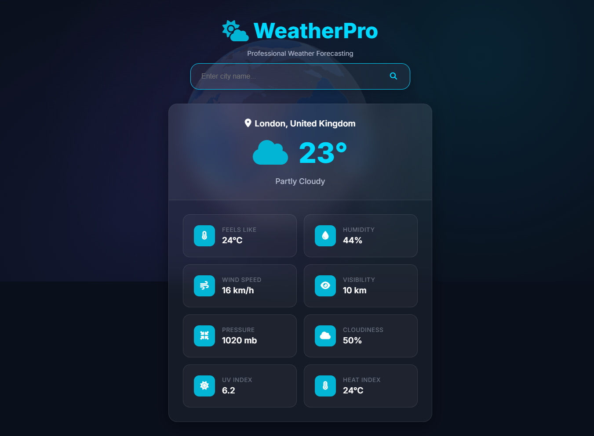

#  WeatherPro, A Professional Weather App

WeatherPro is a weather application built with **HTML, CSS, and JavaScript**. It fetches real-time weather data using the [WeatherAPI](https://www.weatherapi.com/), presenting it through an elegant user interface done by animations, loading effects, and error handling.

## Link of Weather App

[Weather App / WeatherPro](https://weatherpro-by-qasim.netlify.app/)

##  Screenshot

##  Features

-  **City-Based Weather Search**
  - Enter any city name to get real-time weather data.
  - Supports Enter key and click search.

-  **Real-Time Weather Data**
  - Location name and country
  - Temperature (°C)
  - Feels like
  - Humidity
  - Wind speed
  - Visibility
  - Pressure
  - Cloudiness
  - UV Index
  - Heat Index
  - Weather condition description and icon

-  **Dynamic Weather Icons**
  - Automatically changes weather icons based on condition (sunny, cloudy, foggy, rain, etc.)

-  **Fully Responsive Design**
  - Optimized layout for desktop, tablet, and mobile
  - Smooth animations and adaptive card layout

-  **Custom Loader**
  - Loading spinner with blur background while fetching data

-  **Good Error Handling**
  - Empty input
  - Invalid input (e.g. numbers or too short)
  - City not found
  - Network issues
  - Timeout via `AbortController`
  - API errors with fallback

##  Developer Journey

When I started this project, I struggled a lot with **API handling**. Initially, I could only fetch and display data without any kind of input validation, error catching, or loading feedback.

But I soon realized this was not enough for a good user experience. So I went back and improved every part of the app:

- Added **input validation** (empty, too short, numeric checks)
- Used **`try...catch`** for proper error control
- Integrated **`AbortController`** to handle request timeouts
- Designed detailed and contextual **error messages**
- Focused on **responsive design** and **user experience**

This app is a great experience in my frontend learning path.